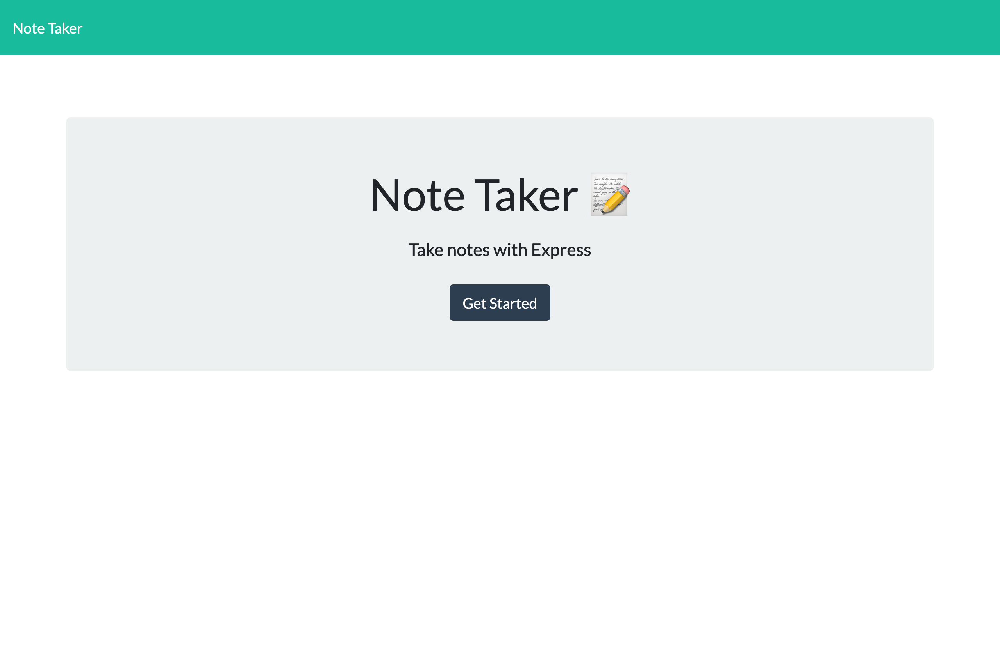
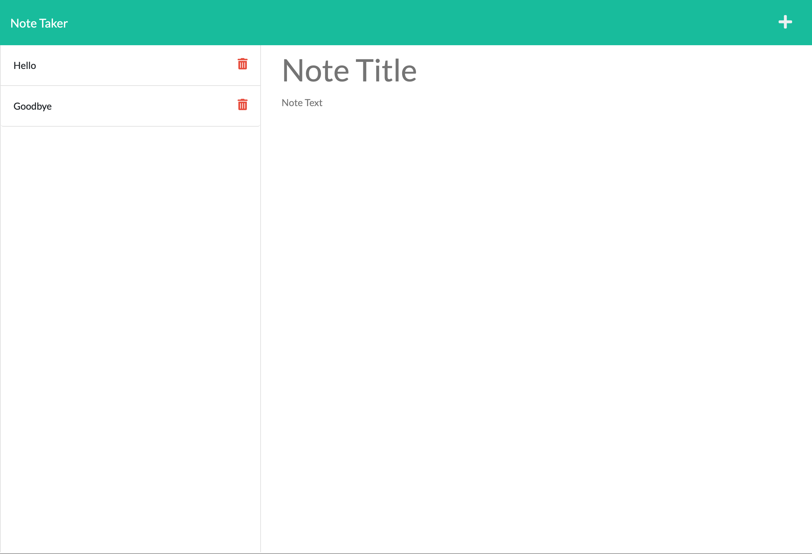

<!-- https://github.com/othneildrew/Best-README-Template -->

<!-- PROJECT LOGO -->
 

  

<h3 align="center">A Simple Note App</h3>

  

    A note app built using JavaScript, Node.js, Express.js
     
     
     
    <a href="https://note-app-lock.herokuapp.com/">View Demo</a>
    ·
    <a href="https://github.com/GarrettLockhart/simple-note-app/issues">Report Bug</a>
    ·
    <a href="https://github.com/GarrettLockhart/simple-note-app/issues">Request Feature</a>
  

 
 
 

<!-- TABLE OF CONTENTS -->

  
Table of Contents

  <ol>
    <li>
      <a href="#about-the-project">About The Project</a>
        <li><a href="#built-with">Built With</a></li>
    </li>
    <li><a href="#live-site">Live Site</a></li>
  </ol>

 

<!-- ABOUT THE PROJECT -->

## About The Project

I built the backend of this app using Node.js and Express.js, taking advantage of modular routing with express. The app will write notes to a json file. And was provided with the front-end source code to work off.

### Built With

- [HTML5](https://developer.mozilla.org/en-US/docs/Web/HTML)
- [JavaScript](https://developer.mozilla.org/en-US/docs/Web/JavaScript)
- [Node.js](https://nodejs.org/en/)
- [Express.js](https://expressjs.com/)

<!-- CONTRIBUTING -->

## Contributing

Any contributions you make are **greatly appreciated**.

If you have a suggestion that would make this better, please fork the repo and create a pull request. You can also simply open an issue with the tag "enhancement".
Don't forget to give the project a star! Thanks again!

1. Fork the Project
2. Create your Feature Branch (`git checkout -b feature/AmazingFeature`)
3. Commit your Changes (`git commit -m 'Add some AmazingFeature'`)
4. Push to the Branch (`git push origin feature/AmazingFeature`)
5. Open a Pull Request

<!-- CONTACT -->

## Live Site

Project Link: [https://note-app-lock.herokuapp.com/](https://note-app-lock.herokuapp.com/)
 
 

 
 

(<a href="#top">back to top</a>)

